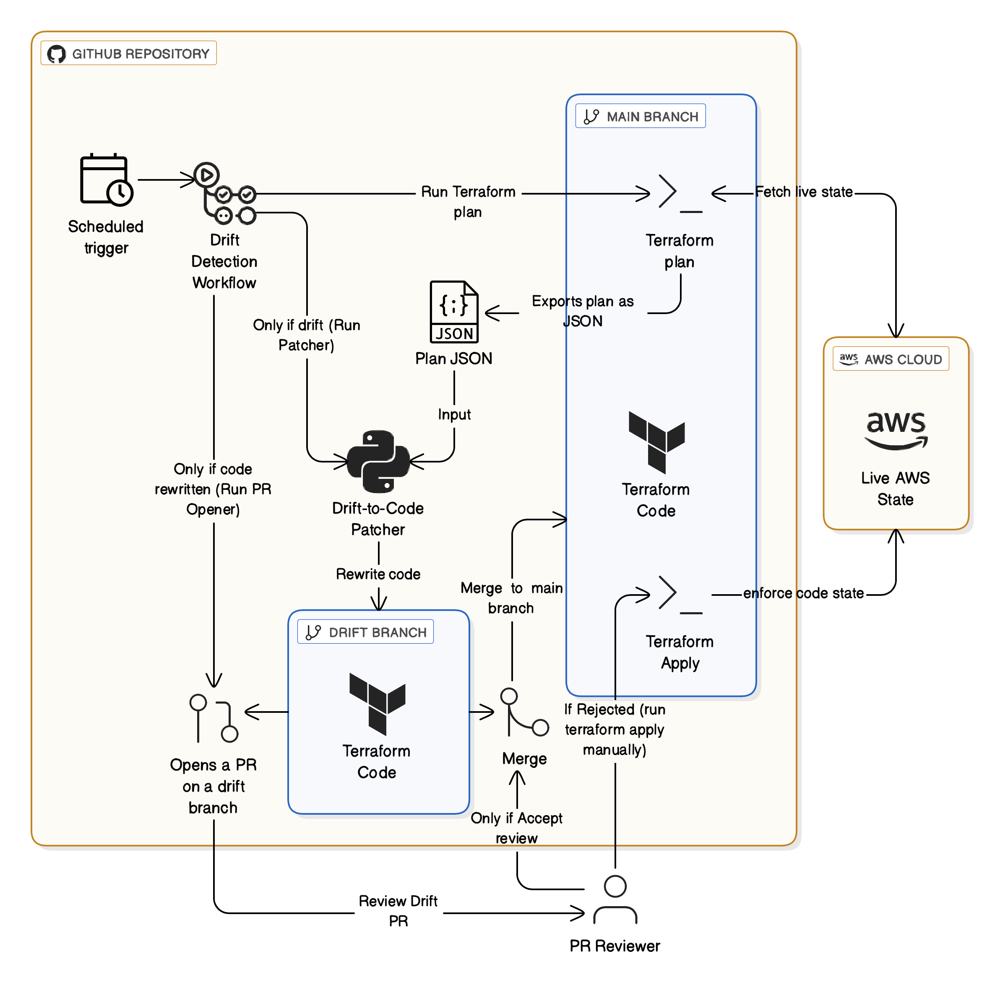

# Terraform Drift → Code (State Sync via Plan JSON)

Keep your **Terraform code** aligned with the **live AWS state** — automatically and reviewably.

This repository contains a GitHub Actions workflow and a Python patcher that:

1. Runs `terraform plan`
2. Converts the saved plan to structured JSON
3. **Rewrites your `.tf` files to match the live state** (what’s currently deployed)
4. Opens a **Pull Request on a new branch** with those code edits for review

---

## What is Terraform drift? (and why this repo exists)

**Terraform drift** is when the **real infrastructure in your cloud** no longer matches what’s declared in your **Terraform code**.  
It happens after manual console edits, emergency hotfixes, scripts/tools that bypass Terraform, or provider-side defaults changing.  

Terraform surfaces drift when you run `terraform plan` by comparing your desired configuration to the actual remote state through the provider APIs.

### Why drift matters
- **Reliability:** unexpected diffs at apply time can break rollouts.
- **Security & compliance:** untracked changes (e.g., widened SG rules, disabled versioning) can violate policy.
- **Single source of truth:** code stops reflecting reality, reviews and audits become harder.

### Two common responses to drift
1. **Push infra back to code’s intent** (standard `terraform apply`): keep code as the source of truth and revert manual edits.  
2. **Pull live state back into code** (this repo): treat the *current cloud state* as the temporary truth and **update the `.tf` files** to match it, via PR review.

This project automates option **(2)** — turning drift from a surprise into an actionable **PR diff**.

---

## Architecture Diagram

 

---

## How it works

1. **Plan**: `terraform plan -out=tfplan`  
2. **Parse**: `terraform show -json tfplan > plan.json`  
3. **Patch**: `scripts/apply_plan_to_code.py plan.json`  
   - Reads **`plan.before`** (the *live state*) and rewrites your `.tf` blocks accordingly  
   - Produces **real code edits** (not just text output)  
4. **PR**: Creates branch `drift-<run_id>` and opens a PR with those changes

---

## What gets updated (v1.3)

- **Scalars**: strings, numbers, booleans  
- **Flat maps** (e.g., `tags`)  
- **Flat lists** (list of scalars)  
- **One-level blocks** (object-like blocks)  
- **Lists of blocks** (repeated object blocks)

All synced **from live state → code** using `plan.before`.

### Skipped (for safety)
- Computed attributes (`id`, `arn`, `tags_all`, etc.)  
- Unknown values  
- Expression-driven lines (`var.`, `local.`, `merge()`, etc.)  
- External modules’ code  
- Whole-resource create/delete (v1.3 only syncs updates)

---

## Tutorial: Using This Project

### 1. Bootstrap the repo (once)
In the `main` branch, include a **bootstrap module** that creates:  
- An **S3 bucket** for state  
- An **IAM role** for GitHub OIDC  

This bootstrap step outputs a `backend.tf` file like:  

```hcl
terraform {
  backend "s3" {
    bucket         = "tf-aws-drift-detection-state-1d0d507b"
    key            = "envs/terraform.tfstate"
    region         = "us-east-1"
    use_lockfile   = true
    encrypt        = true
  }
}
```

Then commit all to your `main` branch.  

---

### 2. Deploy an S3 bucket for test  

```bash
terraform init 
terraform plan  
terraform apply 
```

---

### 3. Run the GitHub Action  
- Manually via **Actions → Run workflow**  
- Or automatically, every hour via the **cron schedule (`0 * * * *`)**


